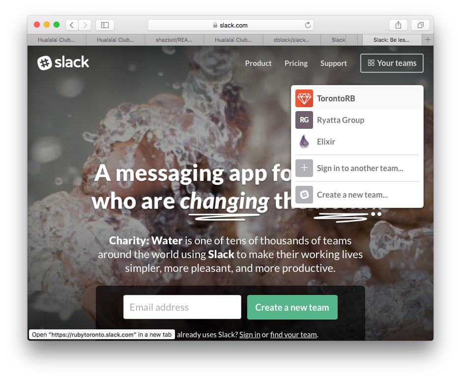
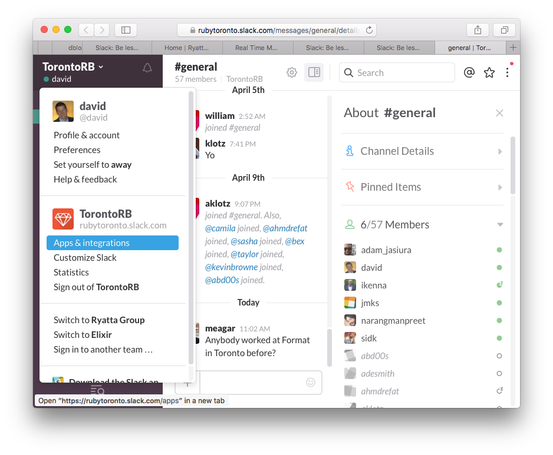
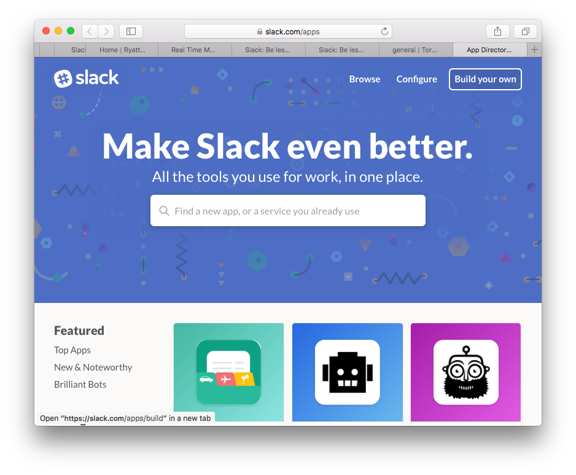
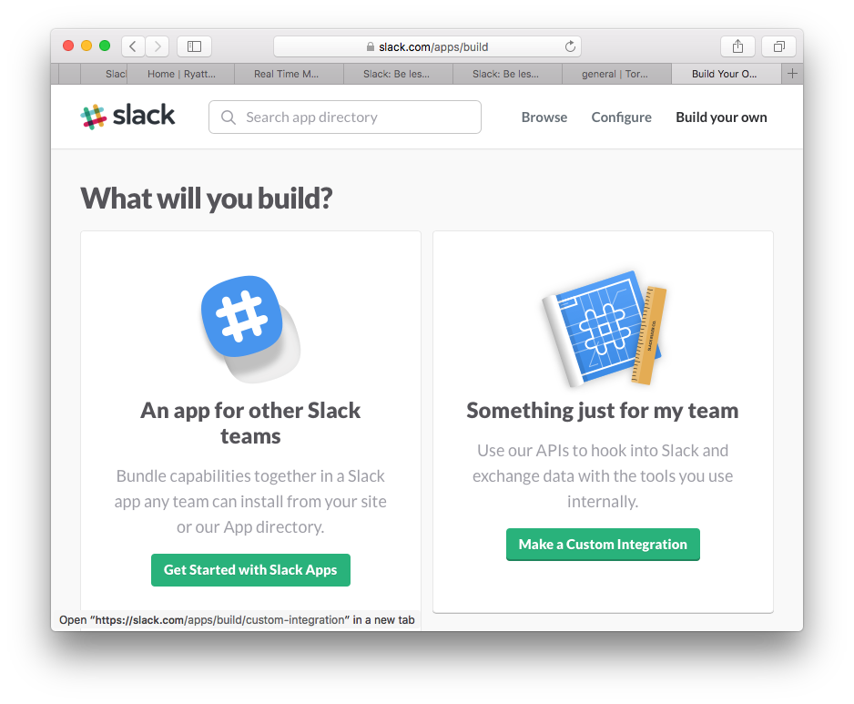
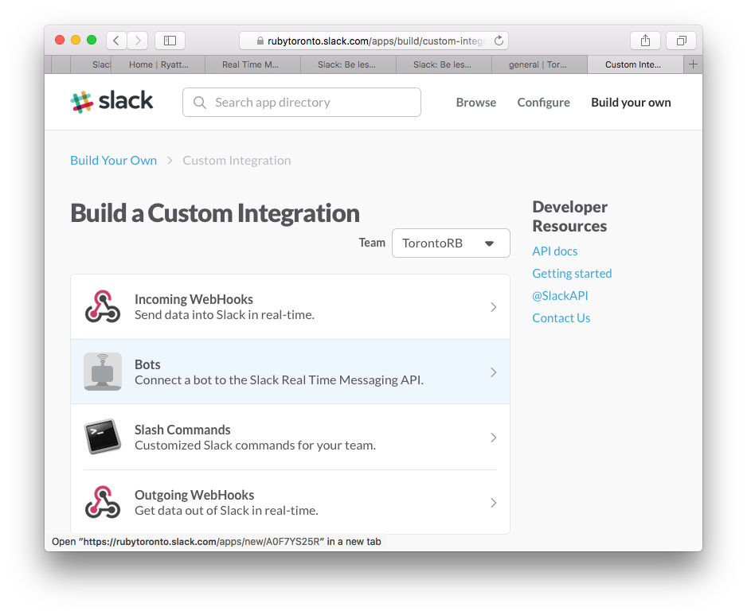
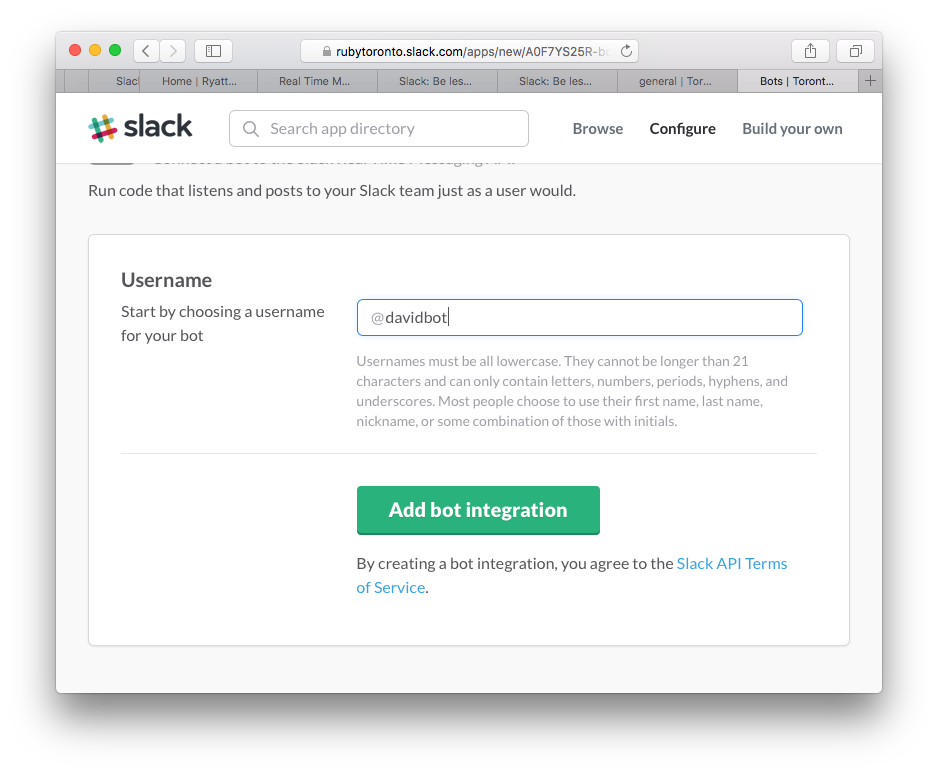
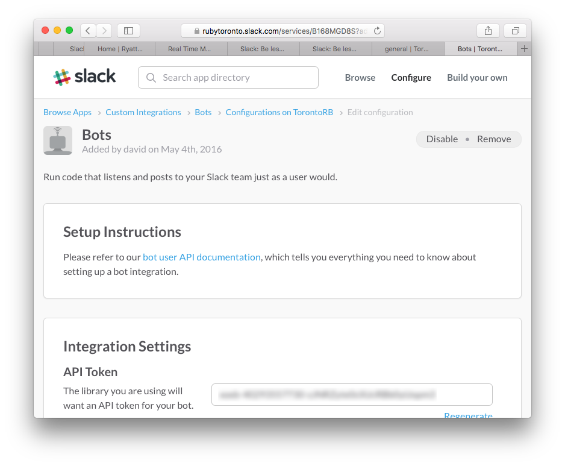
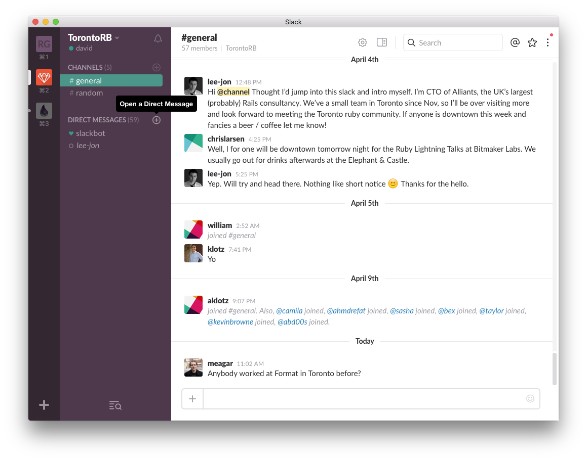
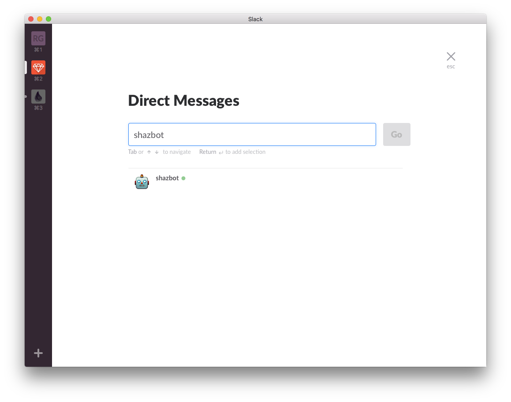
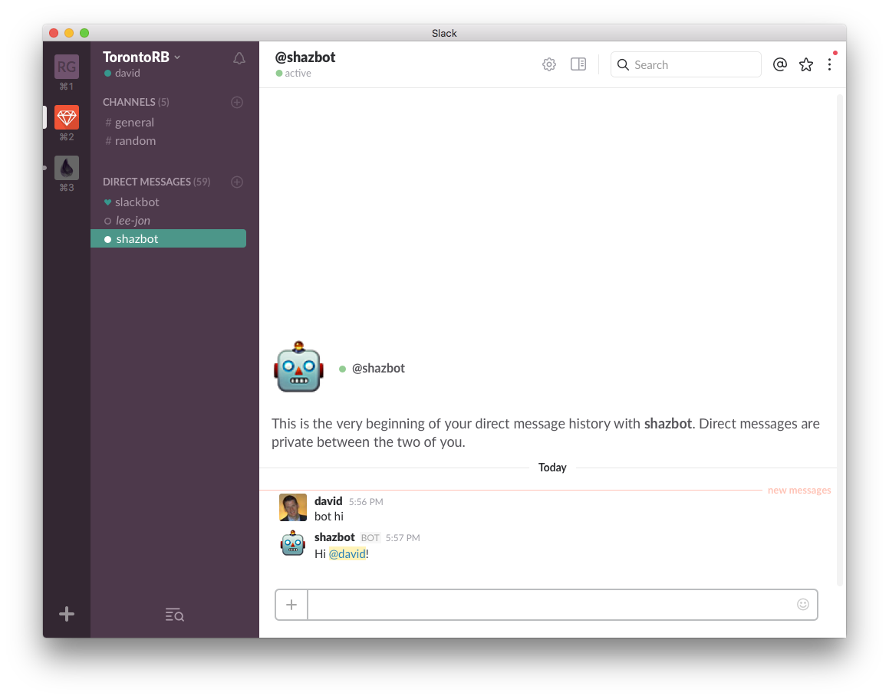

Shazbot - the Ruby Hack Night Chatbot
=====================================

Slides and assets for the Shazbot workshop [first presented at Toronto Ruby Hack Night, May 11, 2016]  
Workshop for learning Chatbots and Slack  
Created by David Andrews and Jason Schweier  

Slides for the workshop are here: _FYI remarkise doesn't work in Safari, sorry_  
https://gnab.github.io/remark/remarkise?url=https://raw.githubusercontent.com/k00ka/shazbot/master/SLIDES.md

###Introduction


This project is a simple Ruby + Slack project. If you follow the instructions below, you can test your machine in advance of the workshop.

###Capabilities

- responds to "hi", "hello" or "howdy" with a greeting [ as presented ]
- responds to "time" with the current time (server timezone) [ as presented ]
- responds to requests for "weather" or "temperature" and a place name with the current temperature (in Celsius) [ as presented ]
- responds to request for "gif" and a topic with an animated gif related to the topic [ as presented ]
- responds to arbitrary Wolfram Alpha requests with text and images (only if Wolfram API key is provided) [ as presented ]
- responds to all other requests with a shrug (only if no Wolfram API key is provided) [ as presented ]
- responds to "stackme" and a topic with the top 5 Stack Overflow search results, or a fun error message [ Josh & Jason ]
- responds to "stackhappy" and a topic with the top Stack Overflow search result (I'm feeling lucky!), or a fun error message [ Josh & Jason ]

###Setup

We have provided a repository which mimics the setup we used last time, so it should be familiar. The code to be created is found in the ``lib/`` directory.

Here are the steps to get you started with the repo.

1. For this workshop, you will need a laptop with the following:
  - [x] Ruby 2.x  
  - [x] A Github account  

  Note: We have included a ``.ruby-version`` file locked to 2.2.3, which you can change to any Ruby 2.x version if you don't have 2.2.3 installed  
  More detailed instructions for each platform are included in the footer. Refer there if you are having issues.

1. Fork the repo (optional, recommended):
  From the page https://github.com/k00ka/shazbot, click the Fork button in the top-right corner. Copy the new repo address (in a box just below the thick red line) into your clipboard. Detailed instructions on forking a repo can be found here: https://help.github.com/articles/fork-a-repo/

1. At Ryatta Group we use rbenv, and so we've included some optional elements - just skip them if you're using rvm or are not versioning your Ruby. If you forked the repo above, your repo_address will be in your clipboard. If not, you should use my repo_address ``git@github.com:k00ka/shazbot.git``

  ```sh
  % git clone <repo_address>
  % cd shazbot
  % gem install bundler
  Fetching: bundler-1.7.4.gem (100%)
  Successfully installed bundler-1.7.4
  1 gem installed
  % bundle
  Fetching gem metadata from https://rubygems.org/.........
  Resolving dependencies...
  Installing rake 10.3.2
  ...
  Using bundler 1.7.4
  Your bundle is complete!
  Use `bundle show [gemname]` to see where a bundled gem is installed.
  ```
  Note: if you use rbenv...
  ```sh
  % rbenv rehash
  ```
  You are (almost) there!

## How to set up a conversation with your own Slackbot
1. In a web browser, go to slack.com and log in,

1. Click on Your teams in the top right corner, and choose TorontoRB,
  - If TorontoRB is not there, surf to slack(dot)rubytoronto(dot)com and sign up,

1. Choose Apps & Integrations from the side menu,

1. Choose Build you own in the top right corner,

1. Choose Make a Custom Integration on the right side,

1. Choose Bots under Build a Custom Integration,

1. Under bots, choose a username for your bot - make it unique and end with “bot”, and click Add bot integration,

1. Copy the API token, finish the form and click Save integration,

1. Back in slack, in the TorontoRB group, choose Open a Direct Message “+”,

1. Type in the name of your bot, and click Go,

1. Create and export a shell variable with your token and run your bot.

1. You are now able to direct message “DM” your bot!

1. Try setting a breakpoint in the Behaviour::Handlers#say_hi method and triggering it by typing "hi" into your chat.

## Congrats on your new Slackbot integration!
